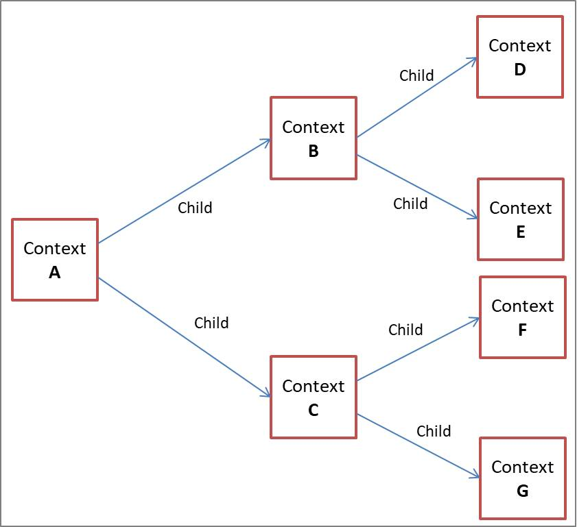

# Golang Context

## Agenda

- Pengenalan Context
- Membuat Context
- Context With Value
- Context With Cancel
- Context With Timeout
- Context With Deadline

## Pengenalan Context

- Context merupakan sebuah data yang membata value, sinyal cancel, sinyal timeout dan sinyal deadline
- Context biasanya dibuat per request (misal setiap ada request masuk ke server web melalui http request)
- Context digunakan untuk mempermudah kita meneruskan value, dan sinyal antar proses

## Kenapa Context Perlu Dipelajari?

- Context di Golang biasa digunakan untuk mengirim data request atau sinyal ke proses lain
- Dengan menggunakan context, ketika kita ingin membatalkan semua proses, kita cukup mengirim sinyal ke context, maka secara otomatis semua proses akan dibatalkan
- Hampir semua bagian di Golang memanfaatkan context, seperti database, http server, http client, dan lain-lain
- Bahkan di Google sendiri, ketika menggunakan Golang, context wajib digunakan dan selalu dikirim ke setiap function yang dikirim

## Package Context

- Context direpresentasikan di dalam sebuah `interface Context`
- Interface Context terdapat dalam package control

## Membuat Context

- Karena Context adalah sebuah `interface`, untuk membuat context kita `butuh sebuah struct` yang sesuai dengan kontrak interface Context
- Namun kita tidak perlu membuatnya secara manual
- Di Golang package context terdapat function yang bisa kita gunakan untuk membuat Context

## Function Membuat Context

- Daftar function:

  

## Parent dan Child Context

- Context menganut konsep parent dan child
- Artinya, saat kita membuat context, kita bisa membuat context dari context yang sudah ada
- Parent context bisa memiliki banyak child
- Namun, child hanya bisa memiliki satu parent context
- Konsep ini mirip dengan pewarisan di pemrograman berorientasi object

## Hubungan antara Parent dan Child Context

- Diagram Parent dan Child context

  

- Parent dan Child context akan selalu terhubung
- Saat nanti kita melakukan misal `pembatalan context A`, maka semua `child` dan `sub-child` dari context A akan `ikut dibatalkan`
- Namun, jika misalnya kita membatalkan context B, hanya context B dan semua child dan sub-childnya yang dibatalkan, maka parent context B (misal context A) tidak akan ikut dibatalkan
- Begitu juga nanti saat kita menyisipkan data ke dalam context A, semua child dan sub childnya bisa mendapatkan data tersebut
- Namun, jika kita menyisipkan data di context B, hanya context B dan semua child dan sub childnya yang mendapat data, parent context B tidak akan mendapat data

## Immutable

- Context merupakan object yang `Immutable`, artinya `setelah Context dibuat`, dia `tidak bisa diubah lagi`
- Ketika kita menambahkan value ke dalam context, atau menambahkan pengaturan timeout dan yang lainnya, secara otomatis akan membentuk child context baru, bukan mengubah context tersebut

## Cara Membuat Child Context

- Membuat child context ada banyak cara, yakni: Context With Value, Context With Cancel, Context With Timeout, Context With Deadline

## Context With Value

- Pada saat awal membuat context, context tidak memiliki value
- Kita bisa menambah sebuah value dengan data `Pair (key-value)` ke dalam context
- Saat kita menambah value ke context, secara `otomatis` akan `tercipta child context baru`, artinya original contextnya tidak akan berubah sama sekali
- Untuk membuat menambahkan value ke context, kita bisa menggunakan function `context.WithValue(parent, key, value)`
