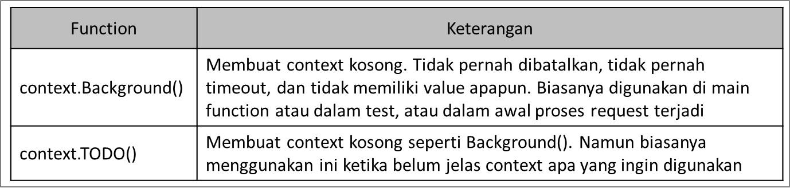

# Golang Context

## Agenda

- Pengenalan Context
- Membuat Context
- Context With Value
- Context With Cancel
- Context With Timeout
- Context With Deadline

## Pengenalan Context

- Context merupakan sebuah data yang membata value, sinyal cancel, sinyal timeout dan sinyal deadline
- Context biasanya dibuat per request (misal setiap ada request masuk ke server web melalui http request)
- Context digunakan untuk mempermudah kita meneruskan value, dan sinyal antar proses

## Kenapa Context Perlu Dipelajari?

- Context di Golang biasa digunakan untuk mengirim data request atau sinyal ke proses lain
- Dengan menggunakan context, ketika kita ingin membatalkan semua proses, kita cukup mengirim sinyal ke context, maka secara otomatis semua proses akan dibatalkan
- Hampir semua bagian di Golang memanfaatkan context, seperti database, http server, http client, dan lain-lain
- Bahkan di Google sendiri, ketika menggunakan Golang, context wajib digunakan dan selalu dikirim ke setiap function yang dikirim

## Package Context

- Context direpresentasikan di dalam sebuah `interface Context`
- Interface Context terdapat dalam package control

## Membuat Context

- Karena Context adalah sebuah `interface`, untuk membuat context kita `butuh sebuah struct` yang sesuai dengan kontrak interface Context
- Namun kita tidak perlu membuatnya secara manual
- Di Golang package context terdapat function yang bisa kita gunakan untuk membuat Context

## Function Membuat Context

- Daftar function:

  
